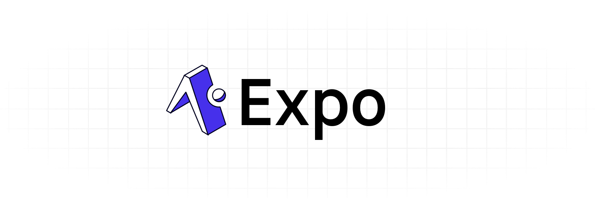

# Documento de Arquitetura

## Histórico de Versão

| Data  | Versão | Descrição | Autor(es)                           |
| :-:   |  :-:   |    :-:    |    :-:                              |
| 12/09 |  0.1   |  Criação da estrutura do documento | [João Vítor](http://github.com/joaovitorml) |
| 13/09 |  0.2   | Atualização do sumário |  [João Vítor](http://github.com/joaovitorml)           |
| 13/09 |  0.3   |  | [Victor Hugo](http://github.com/V100K) e [Rafael Makaha](http://github.com/rafaelmakaha)

## Sumário

[1. Introdução](#1-introdução)

* [1.1 Finalidade](#11-finalidade)
* [1.2 Escopo](#12-escopo)
* [1.3 Referências](#13-referências)
* [1.4 Visão Geral](#14-visão-geral)

[2. Representação da Arquitetura](#2-representação-da-arquitetura)

* [2.1 Arquitetura Nodejs](#21-arquitetura-nodejs)
* [2.2 Arquitetura React Native](#22-arquitetura-react-native)

[3. Metas e Restrições de Arquitetura](#3-metas-e-restrições-de-arquitetura)

[4. Visão Lógica](#4-visão-lógica)

* [4.1 Diagrama de Classes](#41-diagrama-de-classes)
* [4.2 Diagrama de Pacotes](#42-diagrama-de-pacotes)

[5. Visão de Implementação](#5-visão-de-implementação)

[6. Qualidade](#6-qualidade)

## **1. Introdução**

### 1.1 Finalidade

Este documento tem por finalidade, demonstrar uma clara visão da arquitetura do projeto <nome_do_projeto>, a ser implementado, para todos os envolvidos no desenvolvimento; permitindo um entendimento em suas possíveis subdivisões, funções de componentes e reestruturações.

### 1.2 Escopo

Este documento descreve toda a arquitetura do projeto <nome_do_projeto>, explicando as soluções arquiteturais estabelecidas para o projeto. Com isso, possibilita-se a compreensão e o entendimento da base do projeto.

### 1.3 Referências

[1] MERN STACK. Disponível em [MongoDB](https://www.mongodb.com/mern-stack). Acesso em 13 de Setembro de 2020.

[2] MODELO EM TRÊS CAMADAS. Disponível em [Wikipedia](https://pt.wikipedia.org/wiki/Modelo_em_tr%C3%AAs_camadas).Acesso em 13 de Setembro de 2020.

[3] Node.js wiki. Disponível em [Wikipedia](https://en.wikipedia.org/wiki/Nodej). Acesso em 13 de Setembro de 2020.

[4] ReactNative Wiki. Disponível em [Wikipedia](https://en.wikipedia.org/wiki/React_Native). Acesso em 13 de Setembro de 2020.

[5] Expo Wiki. Disponível em [expo.io](https://docs.expo.io/). Acesso em 13 de Setembro de 2020.

### 1.4 Visão Geral

O documento fornece detalhadamente, a nível de compreensão, a arquitetura do projeto. Escolhas de padrões arquiteturais, linguagens, frameworks foram tomadas com base num senso de opinião do grupo a fim de facilitar o trabalho e desenvolvimento com tais tecnologias: Nodejs e React Native.

## **2. Representação da Arquitetura**

O desenho arquitetural do projeto <nome_do_projeto> se faz pelo uso do modelo em três camadas, utilizando-se a _MERN Stack_ - MongoDB, Express, React e NodeJS.

O modelo em três camandas promove o desacoplamento das partes do projeto nas seguies camadas: camada de apresentação - onde há a interação com o usuário -; camada de negócio - onde há as funções e regras de todo o negócio, não havendo uma interface para o usuário -; e a camada de dados - responsável por armazenar as informações e dados a serem manipulados.

A _MERN Stack_ é a solução completa em _Javascript_ para o desenvolvimento de aplicações no modelo de três camadas, proporcionando ferramentas para desenvolvimento e evolução de todas as três camadas.

### 2.1 Arquitetura Nodejs

**Node.js** é um ambiente de desenvolvimento (framework) JavaScript de código aberto, multiplataforma, que executa o código JavaScript fora de um navegador web. Ele permite aos desenvolvedores usarem da linguagem para escrever scripts e automação com servidores, para produzir conteúdo dinâmico de páginas web antes da mesma ser enviada para o navegador do usuário.[3]

O framework permite o uso da arquitetura MC proveniente da arquitetura MVC, deixando de fora a parte que lida com a interface do usuário, a qual será função de outra tecnologia: ReactNative.

Também conta com um outro framework para seus aplicativos web, o **Express**, que fornece um conjunto de recursos e ferramentas mais robustas, minimalista e flexível.

Na camada de bancos de dados, o MongoDB é o sistema de gerenciamento de bancos de dados (SGDB) responsável pela persistência dos dados na aplicação. Assim, sua principal funcionalidade é de armazenar dados de maneira segura e de retorná-los quando forem requisitados.

### 2.2 Arquitetura React Native

React Native é uma estrutura de aplicativo móvel open-source (aberta para o público), criada pelo Facebook, Inc. Ele é usado para desenvolver aplicativos para Android, iOS, Web e UWP, permitindo que os desenvolvedores usem o React juntamente com os recursos nativos da plataforma[4]. Também pode ser descrito como uma biblioteca JavaScript declarativa, eficiente e flexível que permite compor UIs complexas a partir de 'componentes', que são pequenos e isolados códigos.

Para auxiliar o desenvolvimento em ReactNative, dispoem-se do framework 'Expo' o qual facilita o desenvolvimento do mesmo devido a não-necessidade de emular android. O Expo é uma plataforma de código aberto para fazer aplicativos nativos universais que são executados no Android, iOS e web. Ele inclui um tempo de execução universal e bibliotecas que permitem que você construa aplicativos nativos escrevendo React e JavaScript. Este repositório é onde o software do cliente Expo é desenvolvido e inclui os aplicativos, módulos, aplicativos e muito mais do cliente[5].

## **3. Metas e Restrições de Arquitetura**

O desenvolvimento do projeto será em React-Native 0.62.x bem como Express 4.x.x, e para utilização das ferramentas é necessário o requerimento do NodeJS 14.x.x.

O desenvolvimento deverá estar de acordo as boas práticas de programação e requisitos não funcionais para que facilite a manutenção por outras equipes.

<nome_do_projeto> será um _Portable Web Application_ (PWA), ou seja, um aplicativo portável para multiplas plataformas móveis. A aplicação deve rodar em versões superiores a Andoird x.x e IOS x.x. Esta restrição se dá pelos requerimentos das tecnologias utilizadas no desenvolvimento do projeto.

## **4. Visão Lógica**

### 4.1 Diagrama de Classes

### 4.2 Diagrama de Pacotes

## **5. Visão de Implementação**

## **6. Qualidade**
