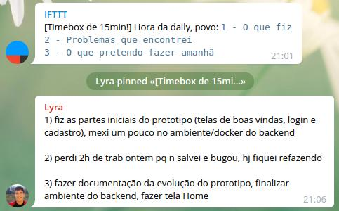
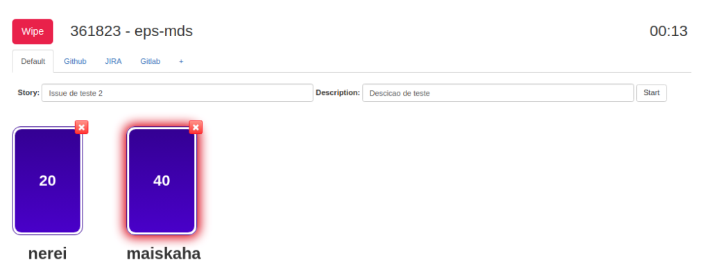

# Plano de Comunicações

## Histórico de versão

|   Data    | Versão | Descrição            | Autor(es)  |
|   :-:     |  :-:   |  :-:                 |  :-:       |
| 12/09/2020|  1.0   | Criação do documento | João Vítor |
| 12/09/2020|  1.0   | Adiciona ScrumPoker | Rafael Makaha |

## Sumário

[1. Introdução](#1-introdução)

[2. Gerenciamento da comunicação](#2-gerenciamento-da-comunicação)
- [Plano de Comunicações](#plano-de-comunicações)
  - [Histórico de versão](#histórico-de-versão)
  - [Sumário](#sumário)
  - [**1. Introdução**](#1-introdução)
  - [**2. Gerenciamento da comunicação**](#2-gerenciamento-da-comunicação)
    - [2.1 Daily](#21-daily)
    - [2.2 Reuniões](#22-reuniões)
    - [2.3 Sistema de pontuação](#23-sistema-de-pontuação)
    - [2.4 Gerenciamento das *issues* e *pull requests*](#24-gerenciamento-das-issues-e-pull-requests)
  - [**3. Ferramentas de comunicação**](#3-ferramentas-de-comunicação)

[3. Ferramentas de comunicação](#3-ferramentas-de-comunicação)

## **1. Introdução**

Este documento tem como finalidade descrever os processos utilizados pela equipe no quesito comunicação entre os membros, tanto os de gerenciamento (EPS) quanto os de desenvolvimento (MDS).

## **2. Gerenciamento da comunicação**

### 2.1 Daily

Foram criadas dailies com o objetivo de cada membro poder informar o status atual de suas atividades.
 
Como o próprio nome diz, elas são feitas diariamente, por volta das 21h, com cada membro enviando uma mensagem de texto respondendo a essas 3 perguntas:

* O que fiz hoje?
* Quais foram os problemas que encontrei?
* O que pretendo fazer amanhã?
 

### 2.2 Reuniões

A reunião de revisão e retrospectiva marca o encerramento de uma sprint e a reunião de planejamento marca o início de uma nova sprint.
 
Decidimos unir essas reuniões em uma só para iniciar uma sprint assim que a anterior é encerrada. Essa reunião de revisão/retrospectiva/planejamento é síncrona e ocorre geralmente (caso não ocorram imprevistos) toda quinta-feira às 18h.
 
Nessa reunião, abrimos um espaço para todos os membros comunicarem como foi a sprint atual na visão de cada um, por meio da listagem de pontos positivos, negativos e problemas encontrados.
 
Também nessa reunião podemos planejar nossa próxima sprint, separando as tarefas entre os membros e pontuando cada *issue* a ser realizada.

### 2.3 Sistema de pontuação

Para pontuar as *issues* na reunião de planejamento, todos colocam a pontuação que acreditam ser justa para cada *issue* e debatemos até encontrarmos um consenso. Na falta do mesmo, escolhemos a pontuação que foi a mais votada.
 

### 2.4 Gerenciamento das *issues* e *pull requests*

A comunicação acerca do cumprimento das *issues* e dos pedidos de revisão de *pull requests* é feito no próprio repositório da equipe, sendo de responsabilidade dos membros checarem o mesmo para se certificarem que suas tarefas estão corretas e atualizadas.
 

## **3. Ferramentas de comunicação**

| Ferramenta | Utilização |
|    :-:     |     :-:    |
|   Github    |     Repositórios do projeto (Wiki, Frontend, Backend); Gerenciamento de *issues* e *pull requests*; Gerenciamento e versionamento  de documentos; Gerenciamento e versionamento do código   |
|   Discord     |   Onde ocorrem as reuniões de review/retrospectiva/planejamento; Também é utilizado como canal extra de comunicação         |
|   Telegram    |   Canal principal de comunicação; Foram criados 3 grupos: um de comunicação apenas para membros EPS, um de comunicação geral para EPS e MDS e um apenas para as dailies   |
| ScrumPoker | Utilizado para pontuar as *issues* |
