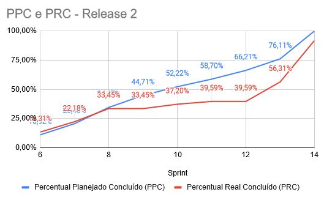
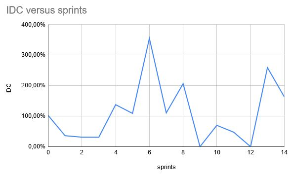
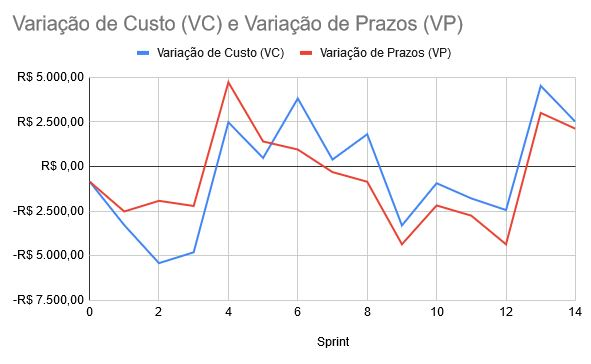

# EVM

## Histórico de versão

|   Data    | Versão | Descrição            | Autor(es)  |
|   :-:     |  :-:   |  :-:                 |  :-:       |
| 05/10/2020|  0.1   | Criação da estrutura do Documento | [João Vítor](https://github.com/joaovitorml) |
| 06/10/2020 | 1.0 | Criação do EVM geral | [Vinícius](https://github.com/faco400), [Antônio Ruan](https://github.com/RuanMoura) e [João Vítor](https://github.com/joaovitorml)

## Sumário

- [EVM](#evm)
  - [Histórico de versão](#histórico-de-versão)
  - [Sumário](#sumário)
  - [1. Introdução](#1-introdução)
  - [2. Colunas](#2-colunas)
    - [2.1 Sprint](#21-sprint)
    - [2.2 Pontos Planejados (PP)](#22-pontos-planejados-pp)
    - [2.3 Pontos Adicionados (PA)](#23-pontos-adicionados-pa)
    - [2.4 Pontos Concluídos (PC)](#24-pontos-concluídos-pc)
    - [2.5 Esforço da Equipe (EE)](#25-esforço-da-equipe-ee)
    - [2.6 Valor Planejado da Sprint (VPS)](#26-valor-planejado-da-sprint-vps)
    - [2.7 Valor Planejado Total (VPT)](#27-valor-planejado-total-vpt)
    - [2.8 Valor Agregado da Sprint (VAS)](#28-valor-agregado-da-sprint-vas)
    - [2.9 Valor Agregado Total (VAT)](#29-valor-agregado-total-vat)
    - [2.10 Custo Real da Sprint (CRS)](#210-custo-real-da-sprint-crs)
    - [2.11 Custo Real Total (CRT)](#211-custo-real-total-crt)
    - [2.12 Variação de Custo (VC)](#212-variação-de-custo-vc)
    - [2.13 Variação de Prazos (VP)](#213-variação-de-prazos-vp)
    - [2.14 Índice de Desempenho de Custo (IDC)](#214-índice-de-desempenho-de-custo-idc)
    - [2.15 Índice de Desempenho de Prazos (IDP)](#215-índice-de-desempenho-de-prazos-idp)
    - [2.16 Pontos Planejados da Release (PPR)](#216-pontos-planejados-da-release-ppr)
    - [2.17 Percentual Planejado Concluído (PPC)](#217-percentual-planejado-concluido-ppc)
    - [2.18 Percentual Real Concluído (PRC)](#218-percentual-real-conluido-prc)
  - [3. Gráficos EVM](#3-gráficos-evm)
    - [3.1 EVM](#31-evm)
    - [3.2 Gráficos PPC e PRC Release 1](#32-)
    - [3.3 Gráficos PPC e PRC Release 2](#33-)
    - [3.4 Gráficos de IDC e IDP](#34-)
    - [3.5 Gráfico de VC e VP](#35-)

## 1. Introdução

O EVM tem como intuito integrar escopo, cronograma e recursos em um projeto, que consiste em medir objetivamente o desempenho e o progresso do projeto comparando custos (real e planejado) e valor agregado.

## 2. Colunas

### 2.1 Sprint

É o período de uma iteração, voltada para o desenvolvimento de um trabalho específico que em sua conclusão é preparado e enviado para uma revisão.

### 2.2 Pontos Planejados (PP)

É o planejamento dos trabalhos que deverão ser realizados durante determinada sprint.

### 2.3 Pontos Adicionados (PA)

São as dívidas técnicas acumuladas e que deverão ser trabalhadas durante a sprint.

### 2.4 Pontos Concluídos (PC)

São os trabalhos que foram devidamente encerrados durante a sprint.

### 2.5 Esforço da Equipe (EE)

É dado pela razão entre os Pontos Concluidos (PC) e os Ponto Planejados (PP). É através dele que é possível identificar o esforço da esquipe em relação a determinada atividade.

### 2.6 Valor Planejado da Sprint (VPS)

É o valor de uma sprint calculado na etapa de planejamento do projeto.

### 2.7 Valor Planejado Total (VPT)

É o Valor Planejado da Sprint (VPS) atual somado com o Valor Planejado Total (VPT) da sprint anterior.

### 2.8 Valor Agregado da Sprint (VAS)

É o produto entre o Esforço da Equipe (EE) e o Valor Planejado da Sprint(VPS).

### 2.9 Valor Agregado Total (VAT)

É o Valor Agregado da Sprint (VAS) atual somado com o Valor Agregado Total (VAT) da sprint anterior.

### 2.10 Custo Real da Sprint (CRS)

É o custo das horas trabalhadas por cada integrante da equipe junto com o custo operacional da semana, também baseado pelas horas trabalhadas.

### 2.11 Custo Real Total (CRT)

É o Custo Real da Sprint (CRS) atual somado com Custo Real Total (CRT) da sprint anterior.

### 2.12 Variação de Custo (VC)

É a diferença algébrica entre o Valor Agregado da Sprint (VAS) e o Custo Real da Sprint (CRS).

### 2.13 Variação de Prazos (VP)

É a diferença algébrica entre o Valor Agregado da Sprint (VAS) e o Valor Planejado da Sprint (VPS).

### 2.14 Índice de Desempenho de Custo (IDC)

É a razão entre o Valor Agregado da Sprint (VAS) e o Custo Real da Sprint (CRS). Índice de Desempenho de Custo (IDC) maior ou igual a 1 indica que os recursos do projeto estão sendo utilizados de forma eficiente.

### 2.15 Índice de Desempenho de Prazos (IDP)

É a razão entre o Valor Agregado da Sprint (VAS) e o Valor Planejado da Sprint (VPS). Índice de Desempenho de Prazos (IDP) maior ou igual a 1 indica ritmo eficiente de avanço no cronograma.

### 2.16 Pontos Planejados da Release (PPR)

É o somatório dos pontos planejados de todas as sprints de cada Release.

### 2.17 Percentual Planejado Concluído (PPC)

É a razão entre os Pontos Planejados da sprint (PP)
e os Pontos Planejados da Release (PPR).

### 2.18 Percentual Real Concluído (PRC)

É a razão entre os Pontos Concluídos da sprint (PC) e os Pontos Planejados da Release (PRC).

## 3. EVM - Tabelas e Gráficos

### 3.1 EVM

[Link para tabelas (e gráficos) no Drive](https://docs.google.com/spreadsheets/d/10vuSwLs7cobxasd3mzD6sRaPbNAktppWo2tsntIRbpQ/edit#gid=0)

### 3.2 Gráficos PPC e PRC Release 1

### 3.3 Gráficos PPC e PRC Release 2

### 3.4 Gráficos de IDC e IDP

- IDC

- IDP

### 3.5 Gráfico de VC e VP

