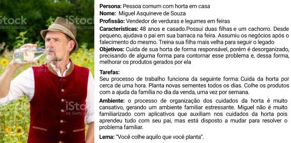
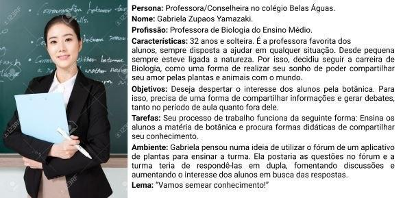

# Documento de Visão

## Histórico de Versão
| Data | Versão | Descrição | Autor |
| :--- | :--- | :--- | :--- |
| 26/08/2020 | 1.0 | Criação e Formatação do Documento  | Arthur Sena |
| 26/08/2020 | 1.0 | Adição tópicos 1, 1.1, 1.2, 1.3, 1.4  | Victor Samuel e Arthur Sena |
| 27/08/2020 | 1.0 | Adição tópicos 2.1, 2.2, 2.3 e 4  | Victor Samuel e Arthur Sena |
| 28/08/2020 | 1.0 | Revisão tópicos 1.2 e 1.4 | Victor Samuel e Arthur Sena | 
| 28/08/2020 | 1.0 | Desenvolvimento tópico 5 | Victor Samuel e Arthur Sena |
| 28/08/2020 | 1.0 | Revisão tópicos 2.1 e 2.2 | Victor Samuel e Arthur Sena |
| 02/09/2020 | 1.0 | Revisão tópico 1.4 | Arthur Sena |
| 25/09/2020 | 1.1 | Atualização de tópicos 1 a 5 | Rafael Makaha e Ruan Moura 
| 26/09/2020 | 1.2 | Adição de personas | João Vítor e Vinícius | 
| 27/09/2020 | 1.3 | Adição tópico 6 | João Vítor, Vinícius e Victor Samuel | 
| 27/09/2020 | 1.4 | Adição tópico 4.3.1 | João Vítor, Vinícius e Victor Samuel | 
| 26/09/2020 | 1.5 | Adição de competidores | Guilherme de Lyra, Arthur Sena e Marcos Gabriel |

## Sumário
[1. Introdução](#1-introdução)

* [1.1 Objetivo](#11-objetivo)
* [1.2 Escopo](#12-escopo)
* [1.3 Definições, Acrônimos e Abreviações](#13-definições-acrônimos-e-abreviações)

[2. Posicionamento](#2-posicionamento)

* [2.1 Oportunidade de Negócios](#21-oportunidade-de-negócios)
* [2.2 O Problema](#22-o-problema)

[3. Descrição do Usuário](#3-descrição-do-usuário)
* [3.1 Tipos de Usuário](#31-equipe-de-gerência)
* [3.2 Principais Necessidades do Usuário](#32-principais-necessidades-do-usuário)
* [3.3 Ambiente do Usuário](#33-ambiente-do-usuário)

[4. Envolvidos](#4-envolvidos)
* [4.1 Equipe de Gerência](#41-equipe-de-gerência)
* [4.2 Equipe de Desenvolvimento](#42-equipe-de-desenvolvimento)
* [4.3 Cliente](#43-cliente)
    * [4.3.1 Personas](#431-personas)

[5. Visão Geral do Produto](#5-visão-geral-do-produto)
* [5.1 Perspectiva do Produto](#51-perspectiva-do-produto)
* [5.2 Resumo de Capacidades](#52-resumo-de-capacidades)
  
[6. Recursos do Produto](#6-recursos-do-produto)
* [6.1 Perfil do Usuário](#61-perfil-do-usuário)
* [6.2 Coleção das Plantas do Usuário](#62-coleção-das-plantas-do-usuário)
* [6.3 Card de Planta](#63-card-de-planta)
* [6.4 Fórum](#64-fórum)
* [6.5 Minha Planta](#65-minha-planta)

[7. Competidores](#7-competidores)

[8. Referências](#8-referências)

## **1. Introdução**

### 1.1. Objetivo
Este documento tem como propósito principal, apresentar uma visão geral sobre o desenvolvimento mobile do GaiaDex, sendo organizado em tópicos que abordam desde o seu contexto de aplicação à suas funcionalidades e público alvo.

### 1.2. Escopo
Este projeto tem como objetivo gerar uma plataforma que facilite o contato entre pessoas interessadas na cultura de jardinagem e, consoante a isso, auxiliar na identificação automática de plantas ao seu redor. 

### 1.3. Definições, Acrônimos e Abreviações
* APP - Aplicativo
* MDS - Métodos de Desenvolvimento de Software

## 2. Posicionamento

### 2.1 Oportunidade de Negócios

No contexto de quarentena atual, diversas pessoas se encontram dentro de suas casas isoladas. Uma das maneiras de entretenimento seria o cultivo de plantas em suas residências. Estes novos aventureiros em jardinagem necessitam de informações sobre suas plantas. Com isso, seria viável gerar uma plataforma para facilitar a troca de informações entre estas pessoas.

### 2.2 O problema

Atualmente existem diversos aplicativos de reconhecimento de plantas, mas nenhum que forneça informações suficientes a respeito de cada uma destas plantas. Com isso, a ferramenta tem por objetivo sanar essa escassez de informações por meio da interação das pessoas.

## **3. Descrição do Usuário**

### 3.1 Tipos de Usuário

| Tipo | Descrição |
| :--- | :--- |
| Usuário comum | Jovens-adultos interessados em jardinagem e/ou na troca de conhecimentos na área. |
| Usuário comum | Pessoas que possuem as próprias plantas e têm dificuldades em mantê-las saudáveis, em identificá-las e em sanar dúvidas mais específicas. |

### 3.2 Principais Necessidades do Usuário

| Necessidade | Interesses | Solução Atual | Solução Proposta |
| :---------- | :--------- | :------------ | :--------------- |
| Identificar determinada planta | Encontrar informações sobre espécie. | <ul><li>Pesquisa com profissionais.</li><li>Outros aplicativos (como PictureThis, PlantNet, LeafSnap…)</li></ul> | Scanner de plantas para identificação das mesmas. |
| Descobrir como cuidar de uma planta. | Manter uma planta saudável. | Pesquisa generalizada em sites de busca. | Aplicação onde possa identificar espécie e receber informação de usuários que já previamente registrados. |
| Discutir assuntos específicos relacionados à plantas | Sanar dúvidas, interagir em discussões pertinentes | Procurar em sites de busca generalizada. |  Um fórum num aplicativo dedicado à isso |
| Gerenciar suas plantas |  Conseguir definir regras de manutenção de suas plantas, como definir:  <ul><li>Quando colher</li><li>Quando regar</li><li>Quando fertilizar</li></ul> | <ul><li>Tabelas analógicas (escritas em papel) ou digitais (excel, etc.);</li><li>Verificação presencial diária;</li><li>Outros aplicativos com jardim virtual</li></ul> | Jardim virtual, podendo-se personalizar a forma de organizá-lo, onde você poderá adicionar suas plantas, definir regras/lembretes de manutenção. |

### 3.3 Ambiente do Usuário
O usuário necessita de um dispositivo móvel Android quanto para iOS, necessitando de acesso a internet.

## **4. Envolvidos**

### 4.1 Equipe de Gerência

|              	|                	|
-------------------|---------------------
|_Representantes_  | Rafael Makaha, João Vitor Morandi, Guilherme de Lyra |
|_Descrição_ | Gestores de projeto.|
|_Tipo_| Discentes da disciplina de Engenharia de Produto de Software na Universidade de Brasília.
|_Critérios de Sucesso_| Manter o foco da equipe, bem como sua motivação para realização das atividades ágeis e finalizar o desenvovimento|
|_Envolvimento_| Alto|

### 4.2 Equipe de Desenvolvimento
|   	|     	|
--------|---------|
|_Representantes_  |Antonio Ruan, Victor Hugo, Marcos Filipe, Marcos Gabriel, Vinícius, Victor Samuel, Arthur Senna |
|_Descrição_ | Desenvolvedores de Software.|
|_Tipo_| Discentes da disciplina de Métodos de Desenvolvimento de Software na Universidade de Brasília.|
|_Critérios de Sucesso_| Realizar o que for proposto cumprindo os prazos e mantendo uma boa qualidade de implementação. |
|_Envolvimento_| Alto|

### 4.3 Cliente

#### 4.3.1 Personas

## **5. Visão Geral do Produto**

### 5.1 Perspectiva do Produto
O GaiaDex é uma plataforma que visa fornecer ao usuario um meio de identificação de plantas, via escaneamento, bem como uma facilidade ao acesso e troca de informações sobre jardinagem. 

### 5.2 Resumo de Capacidades

Dentre os principais recursos do GaiaDex estão Login e Logout de Usuários, busca por plantas, escaneamento de plantas, fornecimento de ambiente para comunicação entre usuários e gerenciamento de jardim virtual.

## **6. Recursos do Produto**

### 6.1 Perfil do Usuário
1. Cadastro e personalização do perfil do usuário por meio do gerenciamento de informações básicas de acesso (email e senha), além dos dados sociais para interação na comunidade, como, username e avatar. 
    
### 6.2 Coleção das plantas do Usuário
1. Scanner identificador de plantas a partir da câmera do seu smartphone.
2. Visualização da coleção de plantas scanneadas pelo usuário. 
3. Visualização do card específico da espécie scanneada pelo usuário. 
    
### 6.3 Card de Planta
1. Visualização de informações gerais e específicas relativas a determinada espécie.
2. Conexão direta do usuário com o fórum de determinada espécie.

### 6.4 Fórum
1. Plataforma de interação entre usuários sobre determinada planta por meio de tópicos e comentários.

### 6.5 Minha Planta
1. Definição de apelido e cronograma de cuidados específicos relativos a cada planta da minha coleção.

## **7. Competidores**
### Considerações
Pensando sobre a perspectiva de que nos propomos a tornarmo-nos numa plataforma mais central, oferecendo tanto a possibilidade de encontrar facilmente informações sobre plantas, como a possibilidade de interagir com outras pessoas acerca deste tema, segue a lista do que identificamos como potenciais competidores:

Consideramos que existem três tiers (categorias) de competidores: 
Principais (proposta similar);
Secundários (alternativa que potenciais usuários podem considerar);
Terciários (semelhança ínfima).

| Marca | Descrição | Desvantagens (em relação ao que propomos) | Tier |
| :-: | :-: | :-: | :-: |
| Plantnet | Aplicativo para identificação de planta | <ul><li>Não há Comunidade</li><li>Interface pouco moderna</li><li>Não há “Meu Jardim”</li></ul> |  Principal | 
| PictureThis | Aplicativo para identificação de planta | <ul><li>Não há Comunidade</li></ul> | Principal |
| Vera | Aplicativo de gerenciamento de cuidados de plantas | <ul><li>Não há Comunidade</li><li>Não há identificação de plantas.</li><ul> | Secundário | 
| LeafSnap | Aplicativo para identificação de plantas | <ul><li>Não há Comunidade</li><li>Não há meu Jardim (apenas “Favoritos”)</li></ul> | Principal |
| Waterbot | Aplicativo de gerenciamento de cuidados de plantas | <ul><li>Não há Comunidade</li><li>Não há identificação de plantas.</li></ul> | Secundário |
| Info PANC | Aplicativo que contém informação de Plantas Alimentícias Não Convencionais | <ul><li>Não há Comunidade</li><li>Não há identificação de plantas.</li><li>Interface pouco moderna</li><li>Não há meu Jardim </li></ul> | Terciário |
| Hortas.info | Site que contém informações sobre Plantas Alimentícias e como cultivá-las | <ul><li>Não há Comunidade</li><li>Não há identificação de plantas.</li><li>Interface pouco moderna</li><li>Não há meu Jardim </li></ul> | Terciário |
| Reddit | Rede social, aplicativo de discussão | <ul><li>Não é direcionado especificamente a plantas</li></ul> | Secundário |
| Facebook | Rede social | <ul><li>Não é direcionado especificamente a plantas</li></ul> | Secundário | 
| Wikipédia | Site de publicação de artigos em assuntos diversos. | <ul><li>Não focado em plantas.</li><li>Sem reconhecimento visual, exige busca manual.</li></ul> | Terciário | 

## **8. Referências**
1. Laços de Alegria. MAKAHA, Rafael; SCHADT, Renan; ALMEIDA, Juliana. Documento de Visão. Disponível em: [Documento de Visão - Laços de Alegria](https://github.com/fga-eps-mds/2018.1-Lacos-da-Alegria/blob/develop/docs/vision_document.md). Acesso em: agosto/2020.
2. Dashboard Ágil. ALVES, Ailamar; AMARAL, Matheus; SANTOS, Damarcones; VICTOR, João; Kalebe. Disponível em: [Documento de Visão - Dashboard Ágil](https://github.com/fga-eps-mds/2019.2-DashboardAgil-Wiki/blob/master/docs/produto/doc_visao.md). Acesso em: agosto/2020.
3. IBM Knowledge Center - Documento de Visão: A estrutura de tópicos do documento de visão. Disponível em: [IBM Knowledge Center - Documento de Visão](https://www.ibm.com/support/knowledgecenter/pt-br/SSWMEQ_4.0.6/com.ibm.rational.rrm.help.doc/topics/r_vision_doc.html). Acesso em: agosto/2020.

